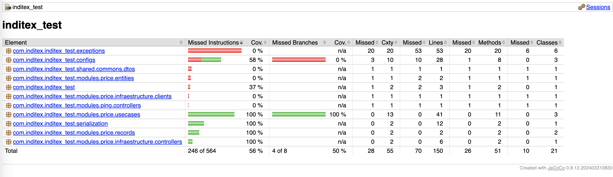
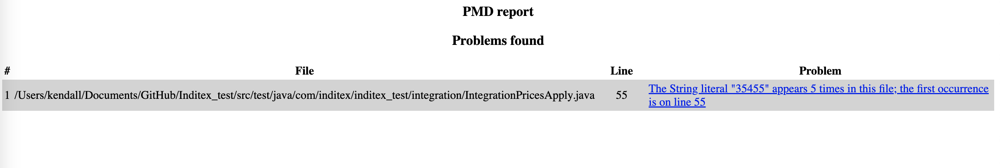

# Inditex Test

This is a test application developed for Inditex, based on Java 17 and Spring Boot.

## Features

- Java 17
- Spring Boot with Jetty
- REST API with Swagger UI
- H2 in-memory database (for development)
- Optional MySQL setup with Docker

---

## Swagger UI

To access the Swagger UI:

1. Run the application.
2. Open your browser and go to: [http://localhost:8080/swagger-ui.html](http://localhost:8080/swagger-ui.html)


---

## Report Jacoco

To access the Report jacoco:

1. Run all test.
2. add :cleanTest :test :jacocoTestReport
3. directory: Inditex_test/build/reports/coverage/index.html



---

## Report PMD

To access the Report pmd:

1. Run task gradle: gradle build
2. directory: Inditex_test/build/reports/pmd/test.html



---

## H2 Database

The application includes an H2 in-memory database for development purposes.

Credentials can be configured in the `application.properties` or `application.yml` file.

---

## Running MySQL with Docker

To spin up a MySQL container for use with the application:

```bash
docker run -d \
  --rm \
  --name mysqlc \
  -p 3306:3306 \
  -e MYSQL_ROOT_PASSWORD=root \
  -v mysql_data:/var/lib/mysql \
  mysql:8.2.0
```

## Running the Application
Make sure you have the following installed:

- Java 17+
- Gradle 
- Docker (optional, for MySQL)

Then you can run the app using your IDE or from the command line:
`./gradlew bootRun`


## Entry point 

The main class of the application is:

```
com.inditex.InditexApplication
```

