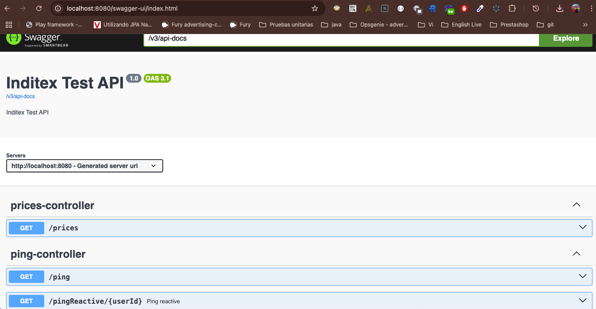

# inditex test

Application for test Inditex

# Show Swagger UI

To show the Swagger UI, you need to run the application and access the following URL: http://localhost:8080/swagger-ui.html

# BD H2

user: sa
password: sa

# Set up a Mysql database with Docker

docker run -d \
--rm \
--name mysqlc \
-p 3306:3306 \
-e MYSQL_ROOT_PASSWORD=root \
-v mysql_data:/var/lib/mysql \
mysql:8.2.0

# Spring Boot App model for Java 17

We provide a basic model for JDK 17 / Spring based web applications.

Please address any questions and comments to [Fury Issue Tracker](https://github.com/mercadolibre/fury/issues).

### Web Server

Each Spring Boot web application includes an embedded web server. For servlet stack applications, Its supports three web Servers:
  * Tomcat (maven dependency: `spring-boot-starter-tomcat`)
  * Jetty (maven dependency: `spring-boot-starter-jetty`)
  * Undertow (maven dependency: `spring-boot-starter-undertow`)

This project is configured with Jetty, but to exchange WebServer, it is enough to configure the dependencies mentioned above in the build.gradle file.

### Main

The main class for this app is Application is InditexApplication.

